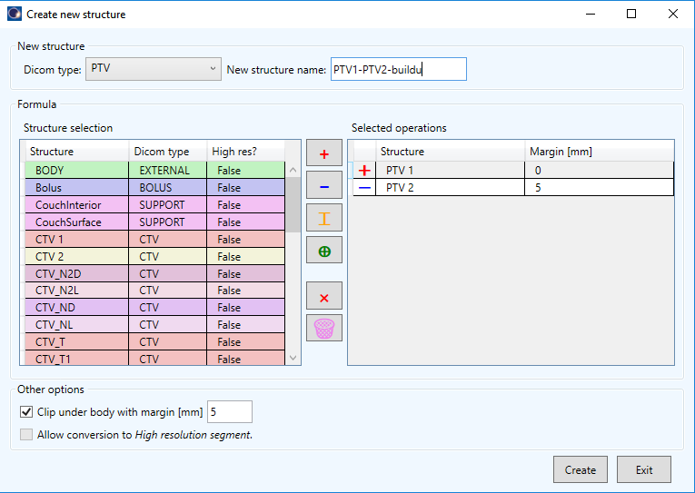
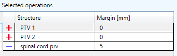

# StructureMargins
A Varian ESAPI script (WriteEnabled) that can be used to create various structures using various operations, such as AND, OR, SUB, XOR and BODY MARGIN.



## Setup

To use the script, you must compile it on your system. You should be able to open the project with Visual Studio 2019 Community Edition. Open the .sln file. 
The script was developed for Eclipse version 15.6. with .NET FrameWork version 4.5. It may not work with other versions of Eclipse or Varian ESAPI. Pull the repository to your T-Box and:

1. Add Varian dlls.
2. Compile as Release for x64.

## How to use the script

A structure set must be active in the context. Run the script. The script does not change any existing structure. The script can only add new structures. It may create temporary structures, which are deleted at the end of operation.

The following rules apply:

1. The script reads the operations in the same order as they are displayed in the right table. For example, if you have three structures like this:


The script will first create an empty structure. To this structure it will add PTV1 with no margin. After that it will add to the previous result PTV2 with no margin again. And then it will subtract from the previous structure the spinal cord prv which will be expanded before subtraction with a margin of 5 mm.

2. Operations on structures of mixed resolution are not possible. If at least one structure is of High Resolution, you have to manually allow the script to convert all structure to High Resolution. When doing so, existing structures are not modified, but are copied and the conversion is performed on the copy.

3. Clipping under the body uses the structure of "EXTERNAL" type as the body. Body is copied to a temp structure and shrunk by the selected margin (negative sign of the margin is applied in the code). Then the intersection of the new body and the structure following all the defined operations is calculated.

## Log


## Important note

**Before using this program see the [licence](https://github.com/brjdenis/VarianESAPI_PlanSum2Plan/blob/master/LICENSE) and make sure you understand it. The program comes with absolutely no guarantees of any kind.**

```
THE SOFTWARE IS PROVIDED "AS IS", WITHOUT WARRANTY OF ANY KIND, EXPRESS OR
IMPLIED, INCLUDING BUT NOT LIMITED TO THE WARRANTIES OF MERCHANTABILITY,
FITNESS FOR A PARTICULAR PURPOSE AND NONINFRINGEMENT. IN NO EVENT SHALL THE
AUTHORS OR COPYRIGHT HOLDERS BE LIABLE FOR ANY CLAIM, DAMAGES OR OTHER
LIABILITY, WHETHER IN AN ACTION OF CONTRACT, TORT OR OTHERWISE, ARISING FROM,
OUT OF OR IN CONNECTION WITH THE SOFTWARE OR THE USE OR OTHER DEALINGS IN THE
SOFTWARE.
```


## LICENSE

Published under the MIT license. 